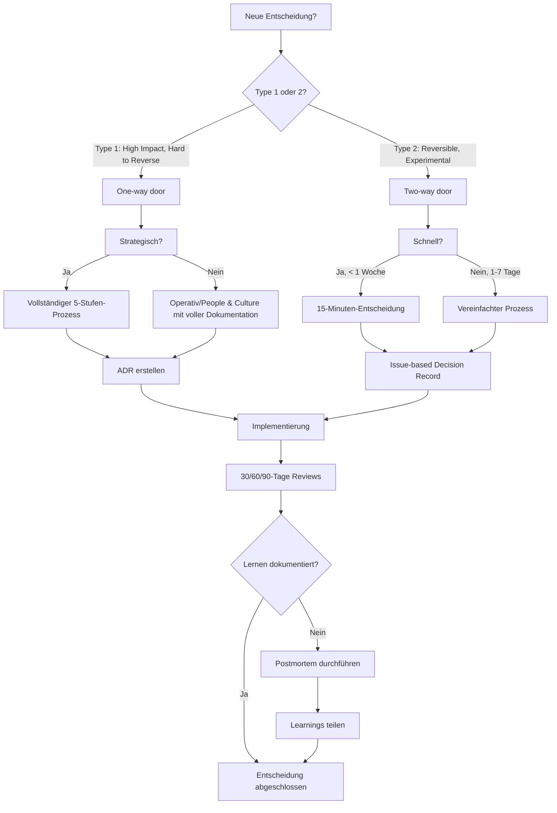

# WeMake Entscheidungsmatrix

## Übersicht

Diese Entscheidungsmatrix hilft dabei, den richtigen Prozess für jede Entscheidung zu wählen. Sie basiert auf zwei
Dimensionen: **Auswirkung** und **Reversibilität**.

## Entscheidungs-Flowchart

## Impact vs. Reversibilität Matrix

| **Auswirkung ↓ / Reversibilität →** | **Niedrig (leicht reversibel)**                                         | **Hoch (schwer reversibel)**                                                                           |
| ----------------------------------- | ----------------------------------------------------------------------- | ------------------------------------------------------------------------------------------------------ |
| **Hoch** (Type 1)                   | **Operative Experimente** Feature-Tests Kleine Prozess-Änderungen | **Strategische One-way doors** Neue Produkte Große Investitionen Langfristige Partnerschaften |
| **Mittel** (Type 2)                 | **Schnelle Tests** A/B-Tests Kleine Tool-Änderungen               | **Mittlere strategische** Team-Neustrukturierung Prozess-Optimierungen                           |
| **Niedrig** (Type 2)                | **15-Minuten-Entscheidungen** Quick Fixes Dokumentations-Updates  | **Routine-Entscheidungen** Standard-Prozesse Normale Ressourcen-Allokation                       |

## Template-Auswahlhilfe

### Welches Template verwenden?

#### Issue Templates

- **`decision-proposal.yml`**: Für neue Entscheidungsvorschläge
- **`decision-record.yml`**: Für dokumentierte Entscheidungen

#### ADR Templates

- **`docs/decisions/template.md`**: Für architekturell bedeutsame Entscheidungen
- **GitHub Issue**: Für operative und People & Culture Entscheidungen

### Wann welches Template?

| Entscheidungstyp     | Issue Template    | ADR Template | Besonderheiten                              |
| -------------------- | ----------------- | ------------ | ------------------------------------------- |
| **Strategisch**      | decision-proposal | Ja           | Immer ADR für Type 1                        |
| **Operativ**         | decision-proposal | Bei Bedarf   | Technische Architektur-Entscheidungen       |
| **People & Culture** | decision-proposal | Nein         | Issue-basiert, außer Richtlinien-Änderungen |
| **Schnell (Type 2)** | decision-record   | Nein         | Vereinfachtes Format                        |

## Stakeholder-Beteiligung Guide

### Wer muss involviert werden?

#### Type 1 Entscheidungen (One-way door)

- **Entscheidungs-Owner**: Immer klar definiert
- **Stakeholder-Gruppen**:
  - Betroffene Teams (alle, die implementieren)
  - Kund:innen-Vertreter (falls relevant)
  - Leadership (für strategische Ausrichtung)
- **Review-Prozess**: Mindestens 2 Reviews vor Entscheidung

#### Type 2 Entscheidungen (Two-way door)

- **Entscheidungs-Owner**: Kann der Vorschlagende sein
- **Stakeholder-Gruppen**:
  - Direkt betroffene Personen
  - Optional: Leadership für Awareness
- **Review-Prozess**: 1 Review ausreichend

### Kommunikations-Matrix

| Entscheidungstyp       | Intern kommunizieren | Extern kommunizieren         | Dokumentation                   |
| ---------------------- | -------------------- | ---------------------------- | ------------------------------- |
| **Type 1 Strategisch** | Vollständig          | Bei Bedarf (Blog, Changelog) | ADR + Issue                     |
| **Type 1 Operativ**    | Betroffene Teams     | Nein                         | Issue + ADR wenn architekturell |
| **Type 2**             | Betroffene Personen  | Nein                         | Issue only                      |

## Zeitrahmen-Empfehlungen

### Type 1: One-way door

- **Kontext sammeln**: 2-5 Tage
- **Optionen erkunden**: 3-7 Tage
- **Impact-Analyse**: 3-5 Tage
- **Entscheidung treffen**: 1-3 Tage
- **Total**: 9-20 Tage

### Type 2: Two-way door

- **Schnell (< 1 Woche)**: 1-3 Tage komplett
- **Normal (1-2 Wochen)**: 3-7 Tage komplett

### Learning & Iteration

- **30-Tage-Review**: Immer
- **60-Tage-Review**: Bei Type 1
- **90-Tage-Review**: Bei strategischen Type 1

## Praxis-Beispiele

### Beispiel 1: Neue Produkt-Feature (Type 1, Strategisch)

**Entscheidung**: Clarity BI um E-Mail-Processing erweitern

1. **Kontext**: Kund:innen wollen automatisierte E-Mail-Verarbeitung
2. **Optionen**:
   - Eigenbau-Lösung
   - Partner-Integration
   - Open-Source-Adaptierung
3. **Impact**: 30 Tage: Erste Tests, 90 Tage: Kund:innen-Piloten, 365 Tage: Produkt-Standard
4. **Entscheidung**: Eigenbau mit Partner-Komponenten
5. **Learning**: Technische Architektur ADRs, Kund:innen-Feedback sammeln

### Beispiel 2: Team-Workflow-Optimierung (Type 2, Operativ)

**Entscheidung**: Async-First Kommunikation einführen

1. **Kontext**: Zu viele Meetings, geringe Fokuszeit
2. **Optionen**:
   - Komplette Meeting-Abschaffung
   - Async-Default mit Meeting-Option
   - Hybride Lösung
3. **Impact**: 30 Tage: Weniger Unterbrechungen, 90 Tage: Produktivitäts-Steigerung
4. **Entscheidung**: Async-Default testen
5. **Learning**: Team-Feedback nach 30 Tagen

### Beispiel 3: Schnelle Design-Änderung (Type 2, 15 Minuten)

**Entscheidung**: Button-Farbe in Web-App ändern

1. **Kontext**: Aktuelle Farbe hat geringe Kontrast
2. **Optionen**: Dunkelblau, Dunkelgrün, Dunkelgrau
3. **Impact**: Sofortige Verbesserung der UX
4. **Entscheidung**: Dunkelblau für bessere Lesbarkeit
5. **Learning**: A/B-Test nach 1 Woche

## Tool-Unterstützung

### GitHub Labels für Entscheidungen

- `decision:type-1` - One-way door Entscheidungen
- `decision:type-2` - Two-way door Entscheidungen
- `decision:strategic` - Strategische Entscheidungen
- `decision:operational` - Operative Entscheidungen
- `decision:people-culture` - People & Culture Entscheidungen

### GitHub Issue Templates

- Verwende `decision-proposal.yml` für neue Vorschläge
- Verwende `decision-record.yml` für dokumentierte Entscheidungen

### ADR Nummerierung

- Starte mit `0001-decision-framework.md` (dieses Dokument)
- Nummeriere fortlaufend für alle architekturell bedeutsamen Entscheidungen

## Häufige Fallstricke vermeiden

### Typische Fehler

1. **Type 1 als Type 2 behandeln**: Unterschätze nicht die Reversibilität
2. **Keine klaren Metriken**: Ohne Messung kein Lernen
3. **Stakeholder vergessen**: Überraschte Teams blockieren Implementierung
4. **Keine Reviews**: Entscheidungen altern schlecht ohne Feedback
5. **Perfektion statt Speed**: Type 2 Entscheidungen nicht überanalysieren

### Best Practices

1. **Bias für Action**: Bei Type 2 schnell entscheiden
2. **Klare Owner**: Jede Entscheidung braucht einen Verantwortlichen
3. **Dokumentation**: Auch kleine Entscheidungen tracken
4. **Lernen teilen**: Erfolge und Misserfolge öffentlich machen
5. **Regelmäßige Reviews**: 30-Tage-Checkpoints nicht vergessen

## Nächste Schritte

1. **Issue erstellen**: Verwende das passende Template
2. **Stakeholder informieren**: Frühzeitige Einbindung sichert Unterstützung
3. **Template ausfüllen**: Strukturiert durch den Prozess gehen
4. **Entscheidung treffen**: Klare Richtung kommunizieren
5. **Umsetzen**: Plan in die Tat umsetzen
6. **Review planen**: Lern-Checkpoints einrichten

---

_Diese Matrix entwickelt sich weiter. Bei Fragen oder Verbesserungen: Issue öffnen oder PR erstellen._
